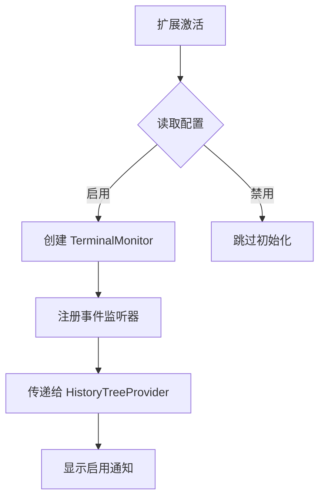
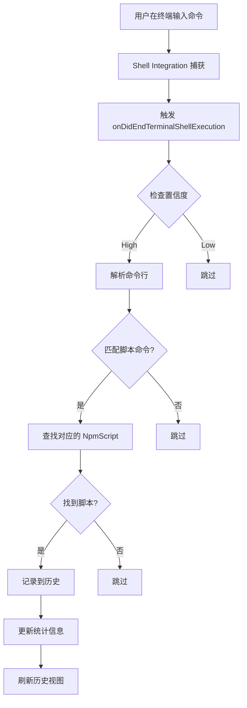
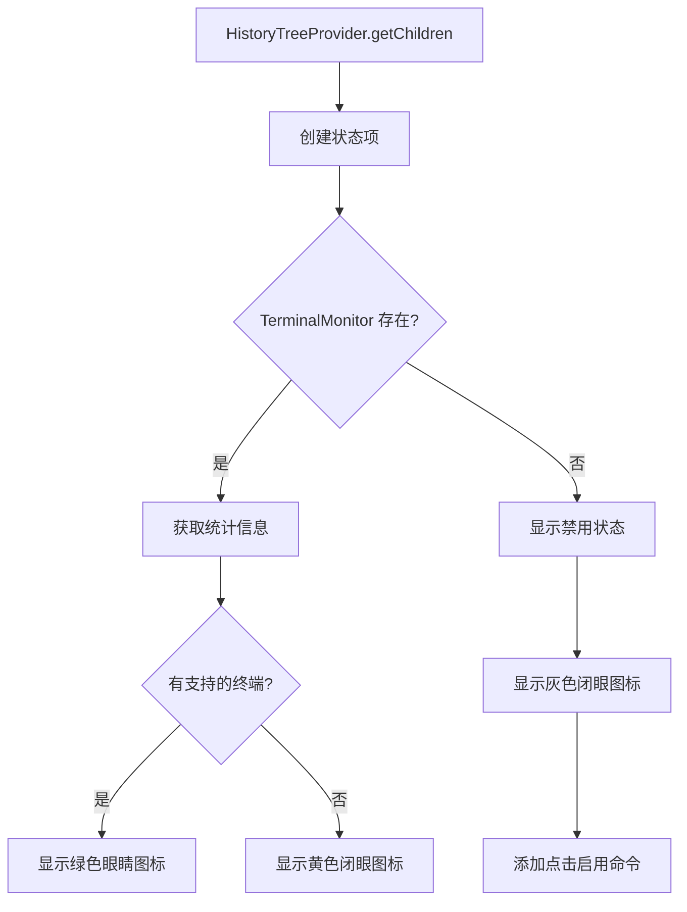

# 终端命令监听功能实现说明

## 📋 功能概述

终端命令监听功能是"脚本管家"扩展的一个**实验性功能**，可以自动捕获并记录用户在 VS Code 集成终端中手动执行的 npm/pnpm/yarn 脚本命令到"最近执行"历史中。

**核心特性：**
- ✅ 自动监听终端中的命令执行
- ✅ 识别 npm/pnpm/yarn 脚本命令
- ✅ 自动记录到"最近执行"历史
- ✅ 实时显示监听状态
- ✅ 可选启用/禁用

---

## 🎯 实现方案

### 技术选型

使用 **VS Code Shell Integration API**，这是官方推荐的终端命令监听方案。

**关键 API：**
- `window.onDidChangeTerminalShellIntegration` - 监听 Shell Integration 激活
- `window.onDidStartTerminalShellExecution` - 监听命令开始执行
- `window.onDidEndTerminalShellExecution` - 监听命令执行结束

**优势：**
- 官方支持，稳定可靠
- 可以获取完整的命令行文本
- 可以获取命令的退出码
- 性能好，准确性高

**限制：**
- 需要 Shell Integration 支持
- 仅支持 bash/zsh/fish/pwsh
- 不支持 cmd.exe

---

## 📁 文件结构

### 新增文件

#### 1. `src/terminalMonitor.ts`

**核心监听模块**，负责：
- 监听终端 Shell Integration 激活
- 监听命令执行开始和结束
- 解析命令行，识别脚本命令
- 记录到历史管理器
- 维护监听统计信息

**关键类：**

```typescript
export class TerminalMonitor {
    constructor(
        private historyManager: HistoryManager,
        private packageScanner: PackageScanner
    )
    
    // 获取监听统计信息
    getStats(): TerminalMonitorStats
    
    // 获取状态描述
    getStatusDescription(): string
    
    // 检查是否有支持的终端
    hasIntegratedTerminals(): boolean
    
    // 统计信息变化事件
    onStatsChange: Event<TerminalMonitorStats>
}
```

**统计信息接口：**

```typescript
export interface TerminalMonitorStats {
    totalTerminals: number;        // 总终端数
    integratedTerminals: number;   // 支持 Shell Integration 的终端数
    commandsCaptured: number;      // 已捕获的命令数
}
```

**命令匹配逻辑：**

```typescript
// 支持的命令模式
const patterns = [
    { regex: /^npm\s+run\s+([^\s]+)/, manager: 'npm' },
    { regex: /^pnpm\s+(?:run\s+)?([^\s]+)/, manager: 'pnpm' },
    { regex: /^yarn\s+(?:run\s+)?([^\s]+)/, manager: 'yarn' }
];

// 跳过非脚本命令
const nonScriptCommands = ['install', 'add', 'remove', 'update', 'init', 'create'];
```

---

### 修改的文件

#### 2. `src/historyTreeProvider.ts`

**添加终端监听状态显示**

**新增类：**

```typescript
class TerminalMonitorStatusItem extends vscode.TreeItem {
    constructor(terminalMonitor: TerminalMonitor | undefined)
}
```

**状态显示逻辑：**
- 如果启用：显示 "终端监听" + 统计信息
- 如果禁用：显示 "终端监听（已禁用）" + 点击启用提示

**图标逻辑：**
- ✅ 有支持的终端：绿色眼睛图标 (`eye`)
- ⏳ 等待激活：黄色闭眼图标 (`eye-closed`)
- ❌ 已禁用：灰色闭眼图标 (`eye-closed`)

**修改的方法：**

```typescript
export class HistoryTreeProvider {
    // 新增方法：设置 TerminalMonitor 实例
    setTerminalMonitor(terminalMonitor: TerminalMonitor | undefined): void
    
    // 修改返回类型，包含状态项
    async getChildren(): Promise<(HistoryTreeItem | TerminalMonitorStatusItem)[]>
}
```

#### 3. `src/extension.ts`

**集成 TerminalMonitor**

**导入：**

```typescript
import { TerminalMonitor } from './terminalMonitor';
```

**初始化逻辑：**

```typescript
// 读取配置
const enableTerminalMonitoring = vscode.workspace
    .getConfiguration('scriptButler')
    .get<boolean>('enableTerminalMonitoring', false);

// 根据配置启用/禁用
if (enableTerminalMonitoring) {
    terminalMonitor = new TerminalMonitor(historyManager, packageScanner);
    context.subscriptions.push(terminalMonitor);
    
    // 传递给 historyTreeProvider
    historyTreeProvider.setTerminalMonitor(terminalMonitor);
    
    // 监听统计信息变化，刷新历史视图
    terminalMonitor.onStatsChange(() => {
        historyTreeProvider.refresh();
    });
}
```

**新增命令：**

```typescript
// 切换终端监听功能
const toggleTerminalMonitoringCommand = vscode.commands.registerCommand(
    'scriptButler.toggleTerminalMonitoring',
    async () => {
        // 切换配置
        // 提示重新加载窗口
    }
);
```

#### 4. `package.json`

**新增配置项：**

```json
{
  "configuration": {
    "properties": {
      "scriptButler.enableTerminalMonitoring": {
        "type": "boolean",
        "default": false,
        "description": "启用终端命令监听功能（实验性）。自动捕获并记录终端中执行的 npm/pnpm/yarn 脚本命令到【最近执行】历史。需要 Shell Integration 支持，仅适用于 bash/zsh/fish/pwsh。"
      },
      "scriptButler.terminalMonitoring.showNotifications": {
        "type": "boolean",
        "default": false,
        "description": "当终端监听捕获到脚本执行时显示通知"
      }
    }
  }
}
```

---

## 🔧 工作流程

### 1. 初始化流程



### 2. 命令捕获流程



### 3. 状态显示流程



---

## 📊 命令匹配规则

### 支持的命令格式

| 包管理器 | 命令格式 | 示例 |
|---------|---------|------|
| npm | `npm run <script>` | `npm run dev` |
| pnpm | `pnpm <script>` | `pnpm dev` |
| pnpm | `pnpm run <script>` | `pnpm run dev` |
| yarn | `yarn <script>` | `yarn dev` |
| yarn | `yarn run <script>` | `yarn run dev` |

### 排除的命令

以下命令不会被识别为脚本命令：
- `install` / `add` / `remove` / `update`
- `init` / `create`

### 匹配流程

1. **正则匹配**：使用正则表达式提取脚本名称
2. **排除检查**：检查是否为非脚本命令
3. **脚本查找**：在 package.json 中查找对应的脚本
4. **记录历史**：如果找到，记录到历史管理器

---

## 🎨 UI 设计

### 历史视图中的状态项

**启用且有支持的终端：**
```
👁️ 终端监听                    2/3 终端
```

**启用但等待激活：**
```
👁️‍🗨️ 终端监听                    0/1 终端
```

**禁用状态：**
```
👁️‍🗨️ 终端监听（已禁用）          点击启用
```

### Tooltip 信息

**启用状态：**
```
终端监听: ✅ 已启用 (2/3 终端支持)

总终端数: 3
支持监听: 2
已捕获命令: 15
```

**禁用状态：**
```
终端监听功能已禁用

点击以启用终端命令监听功能
```

---

## ⚙️ 配置说明

### `scriptButler.enableTerminalMonitoring`

- **类型**：`boolean`
- **默认值**：`false`
- **说明**：启用终端命令监听功能（实验性）

**启用方法：**

1. **通过设置界面**：
   - 打开设置（`Ctrl+,`）
   - 搜索 "scriptButler"
   - 勾选 "Enable Terminal Monitoring"

2. **通过命令**：
   - 打开命令面板（`Ctrl+Shift+P`）
   - 搜索并执行 "脚本管家: 切换终端监听功能"
   - 点击"重新加载"按钮

3. **通过 settings.json**：
   ```json
   {
     "scriptButler.enableTerminalMonitoring": true
   }
   ```

### `scriptButler.terminalMonitoring.showNotifications`

- **类型**：`boolean`
- **默认值**：`false`
- **说明**：当终端监听捕获到脚本执行时显示通知

**效果：**
- 启用后，每次捕获到脚本命令都会显示通知
- 通知内容：`已记录脚本执行: <script-name>`

---

## 🧪 测试指南

### 测试步骤

1. **启用功能**
   ```
   设置 -> scriptButler.enableTerminalMonitoring = true
   重新加载窗口
   ```

2. **打开终端**
   ```
   Ctrl+` 打开集成终端
   ```

3. **等待 Shell Integration 激活**
   ```
   查看"最近执行"视图中的状态项
   应该显示 "终端监听: ⏳ 等待 Shell Integration 激活"
   ```

4. **执行脚本命令**
   ```bash
   npm run dev
   # 或
   pnpm dev
   # 或
   yarn dev
   ```

5. **验证记录**
   ```
   检查"最近执行"视图
   应该看到刚执行的脚本出现在历史中
   ```

6. **检查统计信息**
   ```
   查看状态项的 tooltip
   "已捕获命令" 数量应该增加
   ```

### 测试用例

| 测试用例 | 命令 | 预期结果 |
|---------|------|---------|
| npm 脚本 | `npm run dev` | ✅ 记录到历史 |
| pnpm 脚本 | `pnpm dev` | ✅ 记录到历史 |
| yarn 脚本 | `yarn dev` | ✅ 记录到历史 |
| npm install | `npm install` | ❌ 不记录 |
| 不存在的脚本 | `npm run nonexistent` | ❌ 不记录 |
| Git 命令 | `git status` | ❌ 不记录（未实现）|

---

## 🐛 已知限制

1. **Shell 兼容性**
   - ✅ 支持：bash, zsh, fish, pwsh
   - ❌ 不支持：cmd.exe

2. **激活时机**
   - Shell Integration 不是立即激活的
   - 可能需要等待几秒
   - 某些终端可能永远不会激活

3. **命令识别**
   - 只识别 npm/pnpm/yarn 脚本命令
   - 不识别 Git 命令（可扩展）
   - 不识别其他类型的命令

4. **性能影响**
   - 极低的 CPU 和内存占用
   - 不影响终端响应速度

---

## 🔮 未来扩展

### 可能的增强功能

1. **Git 命令监听**
   - 捕获 `git` 命令
   - 记录到 Git 命令历史

2. **自定义命令模式**
   - 允许用户配置要监听的命令模式
   - 支持正则表达式

3. **命令过滤**
   - 允许用户配置要排除的命令
   - 支持黑名单/白名单

4. **更详细的统计**
   - 按包管理器分类统计
   - 按时间段统计
   - 导出统计报告

---

## 📚 参考资料

- [VS Code Terminal API](https://code.visualstudio.com/api/references/vscode-api#window)
- [Shell Integration](https://code.visualstudio.com/docs/terminal/shell-integration)
- [终端命令监听功能可行性分析](./终端命令监听功能可行性分析.md)

